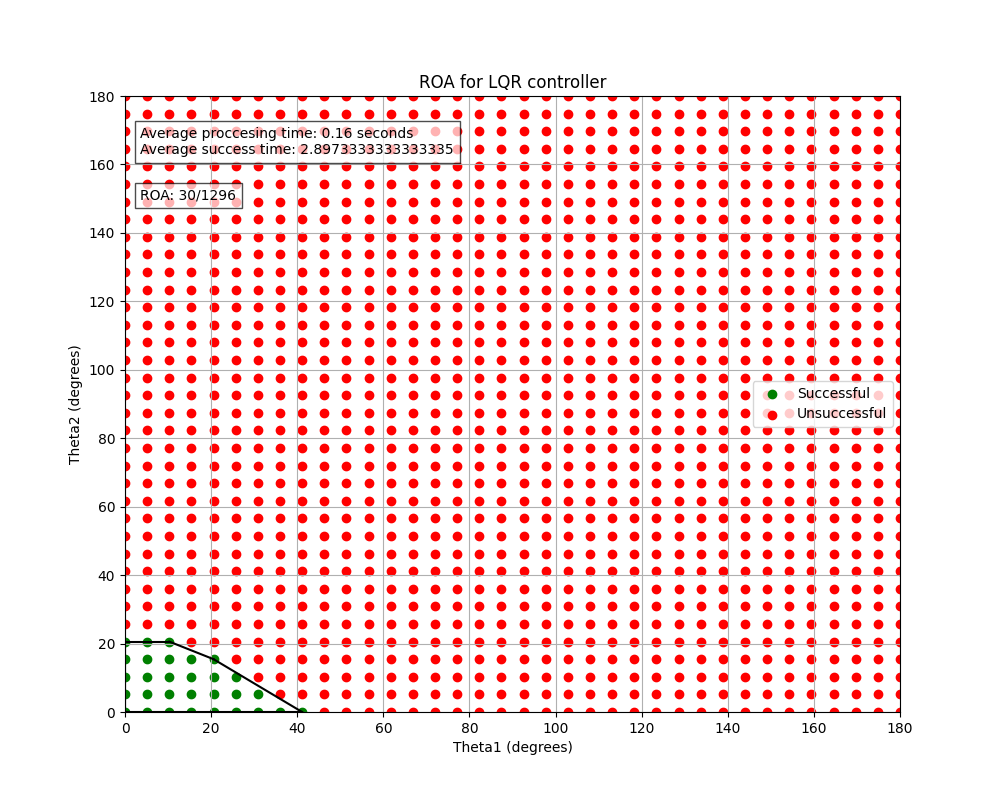

# control-playground

This is a repository for trying control algorithms, which is the content repository of the following article.

[:robot: 二重倒立振子における制御アルゴリズムの比較](https://zenn.dev/kosuke55/articles/double-pendulum-control-kosuke55)

<https://github.com/user-attachments/assets/da0e7875-3ba3-416f-b0e3-ccdcdb947037>

I Implemented a double inverted pendulum simulator and tried the following algorithms.

- [x] PID
- [x] Pole Placement
- [x] LQR
- [x] iLQR
- [x] Linear MPC
- [x] Nonlinear MPC

## Setup

Install rye according to the following.

<https://rye.astral.sh/guide/installation/>

```bash
curl -sSf https://rye.astral.sh/get | bash
```

## Run

Set up a virtual environment with rye.

```bash
source .rye/env
rye sync
source .venv/bin/activate
```

```bash
python control_double_inverted_pendulum.py
```

The default controller_model is LQR. You can change the controller_model by modifying the following line.

```python
controller_mode = "LQR"
```

Also, if you set the following options to `True`, the selected controller will run the simulation only once from the given initial angle state.

```python
run_once = True
```

If you set this to `False`, you can run control repeatedly from various initial values to find the ROA (Region of Attraction).



## Troubleshooting

If matplotlib does not display properly in the virtual environment, run the following command.

```bash
sudo apt-get install python3-tk
```
